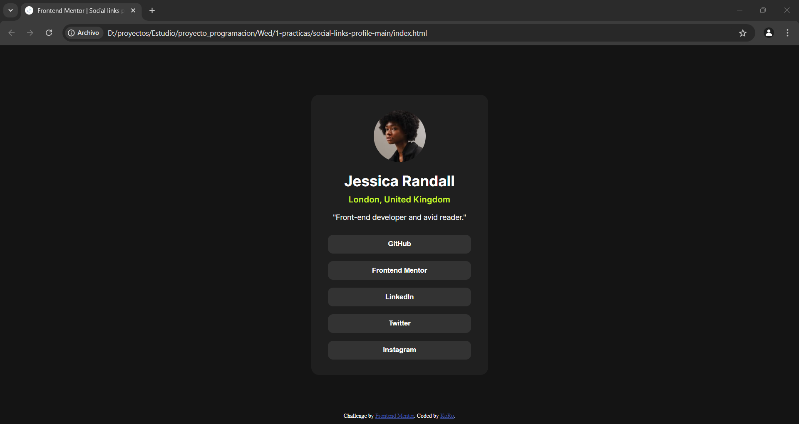

# Frontend Mentor - Social links profile solution

This is a solution to the [Social links profile challenge on Frontend Mentor](https://www.frontendmentor.io/challenges/social-links-profile-UG32l9m6dQ). Frontend Mentor challenges help you improve your coding skills by building realistic projects. 

## Table of contents

- [Overview](#overview)
  - [The challenge](#the-challenge)
  - [Screenshot](#screenshot)
  - [Links](#links)
- [My process](#my-process)
  - [Built with](#built-with)
  - [What I learned](#what-i-learned)
  - [Continued development](#continued-development)
- [Author](#author)

## Overview

### The challenge

Users should be able to:

- See hover and focus states for all interactive elements on the page

### Screenshot



### Links

- Solution URL: [github](https://github.com/bmooiTruth94149/social-links-profile-main)
- Live Site URL: [github page](https://bmooitruth94149.github.io/social-links-profile-main/)

## My process

### Built with

- HTML
- CSS 

### What I learned

```css
/*ajustando las etiquetas html y body a la pantalla*/
html,body{ 
    height: 100%;
    padding: 0;
    margin: 0;
}
body{
    height: 100vh;
}
```

### Continued development

stay focus:
- CSS grid
- Other display methods
- better HTML structure.


## Author

- Frontend Mentor - [KoRo](https://www.frontendmentor.io/profile/bmooiTruth94149)